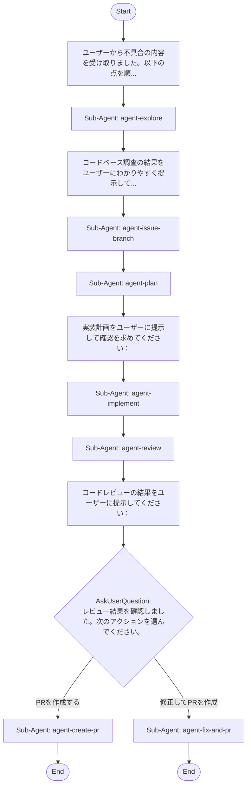

## Workflow Execution Guide

Follow the Mermaid flowchart above to execute the workflow. Each node type has specific execution methods as described below.

### Execution Methods by Node Type

- **Rectangle nodes (Sub-Agent: ...)**: Execute Sub-Agents
- **Diamond nodes (AskUserQuestion:...)**: Use the AskUserQuestion tool to prompt the user and branch based on their response
- **Diamond nodes (Branch/Switch:...)**: Automatically branch based on the results of previous processing (see details section)
- **Rectangle nodes (Prompt nodes)**: Execute the prompts described in the details section below

## Sub-Agent Node Details

#### agent-explore(Sub-Agent: agent-explore)

**subagent_type**: explore

**Description**: コードベースを調査して不具合の関連箇所を特定

**Prompt**:

```
報告された不具合に基づいて、InkGraphのコードベース（src-tauri/src/ および src/ 配下）を調査してください。

調査内容：
1. 不具合に関連するモジュール・ファイルを特定（CLAUDE.mdのコードレイアウト早見表を参考に）
2. 関連する関数・処理の実装を確認
3. 不具合の根本原因の仮説を立てる
4. 関連するテストがあれば確認
5. 直近のgit logで関連する変更がないか確認

調査結果として、関連ファイルと行番号・根本原因の仮説・影響範囲をまとめてください。
```

**Parallel Execution**: enabled

When executing this node, assess whether the task involves multiple independent areas or concerns.
If so, launch multiple agents of the same subagent_type in parallel — one per independent area.

Guidelines:
- Single area of concern → execute with 1 agent
- Multiple independent areas → spawn 1 agent per area, execute in parallel
- Wait for all agents to complete before proceeding to the next node
- Consolidate all agent results before passing to the next node

#### agent-issue-branch(Sub-Agent: agent-issue-branch)

**Description**: GitHub Issueを作成してブランチを切る

**Prompt**:

```
合意した内容に基づいてGitHub Issueを作成し、作業ブランチを切ってください。

手順：
1. `gh issue create` でIssueを作成
   - タイトル：不具合の簡潔な説明（日本語可）
   - ボディ：再現手順・期待動作・実際の動作・根本原因仮説・修正方針を含める
   - ラベル：`bug` を付与
2. 作成したIssue番号を確認
3. `git checkout -b fix/issue-<番号>-<短い英語説明>` でブランチを作成
4. Issue番号とブランチ名を出力する

注意：CLAUDE.mdのGit規約に従い、破壊的なgit操作は行わないこと。
```

#### agent-plan(Sub-Agent: agent-plan)

**subagent_type**: plan

**Description**: 不具合修正の実装計画を立案する

**Prompt**:

```
合意した根本原因と修正方針に基づいて、具体的な実装計画を立案してください。

計画に含める内容：
1. **修正対象ファイルと変更箇所**（ファイル名:行番号）
2. **修正手順**（ステップバイステップ）
3. **影響を受ける可能性がある他の箇所**
4. **テスト方針**（既存テストの確認 + 追加すべきテスト）
5. **リスクと注意点**

InkGraphの特性（Rust/Tauri バックエンド + React フロントエンド）とCLAUDE.mdの注意点（チューニング定数・DBマイグレーション・YOLOクラスIDなど）を考慮してください。
```

**Parallel Execution**: enabled

When executing this node, assess whether the task involves multiple independent areas or concerns.
If so, launch multiple agents of the same subagent_type in parallel — one per independent area.

Guidelines:
- Single area of concern → execute with 1 agent
- Multiple independent areas → spawn 1 agent per area, execute in parallel
- Wait for all agents to complete before proceeding to the next node
- Consolidate all agent results before passing to the next node

#### agent-implement(Sub-Agent: agent-implement)

**Description**: 承認された計画に基づいて修正を実装する

**Prompt**:

```
承認された実装計画に従って、不具合修正を実装してください。

実装時の注意事項：
1. CLAUDE.mdの規約に従うこと（コメントは最小限・セキュリティ考慮など）
2. DBスキーマ変更が必要な場合は新しいマイグレーションファイルを追加（既存ファイルは変更しない）
3. YOLOクラスIDを変更する場合はdocs/spec.mdも確認・更新
4. Rust側は `cargo test --lib -- --test-threads=1` でテストを実行して確認
5. フロントエンドは `npx tsc -b --noEmit` と `npm run lint` で確認
6. 変更したファイルと変更内容の概要を最後に出力すること
```

#### agent-review(Sub-Agent: agent-review)

**Description**: 実装のコードレビューとspec.md整合性チェックを実施

**Prompt**:

```
実装された修正コードのコードレビューを行ってください。

レビューの観点：
1. **正確性**: 根本原因を正しく修正しているか、新たなバグを生んでいないか
2. **セキュリティ**: コマンドインジェクション等のOWASP Top 10脆弱性がないか
3. **コード品質**: CLAUDE.mdの規約に沿っているか（コメント・命名・不要な抽象化がないか）
4. **テスト**: 修正に対応するテストが適切に追加・更新されているか
5. **spec.md整合性**: 挙動変更がある場合、docs/spec.mdと矛盾していないか（あれば更新提案も）

問題点をcritical / warning / info に分類し、良かった点も含むレビューレポートを作成してください。
```

#### agent-create-pr(Sub-Agent: agent-create-pr)

**Description**: Pull Requestを作成する

**Prompt**:

```
実装した修正のPull Requestを作成してください。

手順：
1. 変更ファイルをステージング（.envや機密ファイルを除く）
2. コミットメッセージは `fix(<scope>): <日本語の説明>` 形式で作成
   末尾に: Co-Authored-By: Claude Sonnet 4.6 <noreply@anthropic.com>
3. `git push -u origin <ブランチ名>` でプッシュ
4. `gh pr create` でPRを作成：
   - タイトル：簡潔な修正説明（70文字以内）
   - ボディ：修正内容・テスト方法・`Closes #<Issue番号>` を含める
5. PRのURLを出力する

CLAUDE.mdのGit規約に従い、`--no-verify` は使わないこと。
```

#### agent-fix-and-pr(Sub-Agent: agent-fix-and-pr)

**Description**: レビュー指摘を修正してPull Requestを作成する

**Prompt**:

```
レビューで指摘された問題を修正してから、Pull Requestを作成してください。

手順：
1. レビューのCritical/Warning指摘事項を修正する
2. 修正後、`cargo test --lib -- --test-threads=1` と `npx tsc -b --noEmit` で確認
3. 変更ファイルをステージング（機密ファイルを除く）
4. コミット（`fix(<scope>): <説明>` 形式、Co-Authored-By 行を末尾に追加）してプッシュ
5. `gh pr create` でPRを作成：
   - タイトル：不具合修正の説明（70文字以内）
   - ボディ：修正内容・レビュー指摘への対応・テスト方法・`Closes #<Issue番号>`
6. PRのURLを出力する
```

### Prompt Node Details

#### prompt-gather(ユーザーから不具合の内容を受け取りました。以下の点を順...)

```
ユーザーから不具合の内容を受け取りました。以下の点を順番に質問して詳細を収集してください：

1. どのような操作をしたときに発生するか（再現手順）
2. 期待する動作と実際の動作の差異
3. エラーメッセージやログがあれば内容
4. 発生頻度（毎回 / 時々 / 特定条件下）
5. いつから発生しているか、最近の変更との関連

質問への回答が得られたら、不具合の概要を簡潔にまとめて確認を取り、合意してから次のステップへ進んでください。
```

#### prompt-confirm-root(コードベース調査の結果をユーザーにわかりやすく提示して...)

```
コードベース調査の結果をユーザーにわかりやすく提示してください：

1. **特定した関連箇所**（ファイル名:行番号）
2. **根本原因の仮説**
3. **影響範囲**
4. **修正の方向性**（案）

提示後、ユーザーに確認を求めてください：
- 「この分析内容で合っていますか？」
- 「修正方針について追加のご要望や懸念点はありますか？」

ユーザーから承認・修正方針の合意が得られ、内容が確定してから次のステップへ進んでください。
```

#### prompt-confirm-plan(実装計画をユーザーに提示して確認を求めてください：)

```
実装計画をユーザーに提示して確認を求めてください：

1. 計画の内容を要約して提示する
2. 以下を確認：
   - 「この実装計画で進めてよいですか？」
   - 「修正範囲や方針について変更したい点はありますか？」
   - 「特に気をつけてほしい点はありますか？」

ユーザーから修正要望があった場合は計画を調整して再確認し、最終的な合意が取れてから次のステップへ進んでください。
```

#### prompt-review-result(コードレビューの結果をユーザーに提示してください：)

```
コードレビューの結果をユーザーに提示してください：

1. **Critical問題**（マージ前に必須対応）があれば明確に示す
2. **Warning**（対応推奨）の内容
3. **Info**（参考情報）
4. **良かった点**

提示後、ユーザーに確認してください：
- Critical/Warningがある場合：「修正が必要な指摘があります。どう対応しますか？」
- 問題がない場合：「レビューは問題なしです。このままPRを作成してよいですか？」

次のステップ（PR作成 or 修正してPR）の判断材料を提供してください。
```

### AskUserQuestion Node Details

Ask the user and proceed based on their choice.

#### ask-pr-approval(レビュー結果を確認しました。次のアクションを選んでください。)

**Selection mode:** Single Select (branches based on the selected option)

**Options:**
- **PRを作成する**: 現在の実装でそのままPull Requestを作成します
- **修正してPRを作成**: レビューの指摘事項を修正してからPull Requestを作成します
